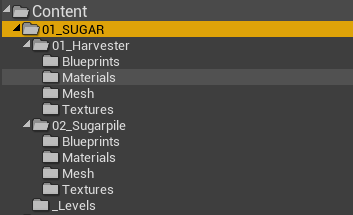

# **Как подготовить ассеты на Unreal Engine 4.27 для Carrot**

> В этом разделе на примерах вы узнаете, как создавать ассеты, готовые для работы с Carrot. В раздел входит структура папок, правильная иерархия элементов на уровне, вынесение объектов на слои в редакторе для удобной работы и настройка управляющей логики под наш плейлист.

## **Cтруктура папок. Как правильно это делать**

У каждого ассета должна быть своя папка, желательно с порядковым номером и капсом. Это очень круто и удобно. Внутри будут появляться папки с названием содержимого:


В вашей папке могут быть и будут:
 
    Animations - всякие анимации для Skeletal Mesh, алембики, секвенцеры и т.д.
    Blueprints - управляющие блупринты, префабы объектов, Material Parameter Collection и т.д.
    FX - эффекты Niagara и Cascade
    Levels - уровни с объектами
    Materials
    Mesh
    Textures

Если подходящих объектов для папки нет, тех же анимаций, то смысла создавать папку нет.

Если объектов внутри одного сюжета несколько, то сначала надо создать папку с именем объекта, а внутри неё уже устраивать наполнение по умолчанию. Структура будет иметь следующий вид:



В примере выше объекты не имеют отдельных уровней и собраны вместе на одном, поэтому папка `Levels` находится в корне папки `01_SUGAR`.

### **Материалы**

Материалы называем также как и ассет, если требуется разбить на несколько материалов, то пишем `M_` + `название ассета` + `_название детали или группы деталей`. Если используем мастер материалы, то пишем `MM_` + `название ассета`, а инстансы подписываем `MI_` + `название ассета` + `_название детали или группы деталей`.

> Кому интересны все рекомендованные префиксы ассетов - [ссылка на док](https://docs.unrealengine.com/4.27/en-US/ProductionPipelines/AssetNaming/).

**Пример:**
    
    M_Harvester_glass
    M_Harvester_wheels
    M_Harvester_chassis
    M_Harvester_gum
    M_Harvester_plastic
    MM_Harvester
    MI_Harvester_wheels

### **Текстуры**

Текстуры называем по той же логике что и все остальное: `T_название ассета_суффикс`.

> **T** for **ТЕКСТУРА**

Тип текстуры | Суффикс
-|-
**Base color** | _D
**Metallic** | _M
**Specular** | _S
**Roughness** | _R
**Normal** | _N
**Displacement** | _DP
**Ambient Occlusion** | _AO
**Height Map** | _H
**Flow Map** | _FM
**Light Map (fake)** | _L
**Mask** | _MA

**Пример:**
    
    T_Harvester_D
    T_Harvester_M
    и.т.д.

## **Иерархия объектов на уровне. Как надо, чтобы инженеры зауважали**

Первым делом нужно создать новый уровень, в который мы будем накидывать объекты и настраивать, по первому времени, ассеты. Уровень называем по имени главного ассета, либо подводки, под которую ассеты создаются: `название ассета`. Если уровень составной или имеет несколько итераций, то пишем `название ассета` + `_назначение` + `_порядкой номер`.

**Пример:**
    
    SUGAR
    SUGAR_lighting
    SUGAR_lighting_02
    SUGAR_02_environment_03
    и.т.д.

Открываем уровень, кидаем объекты, развлекаемся.
    

Итак, структура папок создана, текстуры и анимации раскиданы по папкам, материалы накручены, блупринты накожены, свет выставлен. **Что дальше?**

После всех наших первичных манипуляций иерархия уровня, скорее всего, будет выглядеть так:
    

На выходе мы должны получить следующую иерархию:
    

Почему такую? **Разбираемся**:

```
. level_SUGAR (Editor)
├── 📁 01_SUGAR
│  ├── 🔵 null_Harvester
│  │  ├── 🟢 hlp_Harvester
│  │  │  ├── 🔴 BP_Harvester
│  │  ├── 💡 RL_Harv_01
│  │  ├── 💡 RL_Harv_02
│  │  ├── 💡 RL_Harv_03
│  │  ├── 💡 RL_Harv_04
│  ├── 🔵 null_SugarPile
│  │  ├── 🟢 hlp_SugarPile
│  │  │  ├── 🔴 BP_SugarPile
│  │  ├── 💡 PL_Sugar_01
│  │  ├── 💡 PL_Sugar_02
│  │  ├── 💡 PL_Sugar_03
│  │  ├── 💡 PL_Sugar_04

    📁 - папка, в которой мы храним все объекты сцены. Когда на уровне будет 10-20 разных ассетов и нужно будет быстро переключаться между ними, папки - ваше спасение.
    🔵 - Empty Actor, к которому привязаны все, что относится к объекту. За него можно быстро перетащить всю структуру вместе со светом и ничего не потерять.
    🟢 - Empty Actor,
    🔴 - Blueprint с нашим объектом. Перетаскивать его напрямую в сессии мультиюзера крайне не рекомендуется, т.к. высока вероятность, что выполнение логики остановится.
    💡 - Разные источники света, крутятся вместе с 🔵 null
```

# TODO
- [] Проверяем Pivot в блупринте