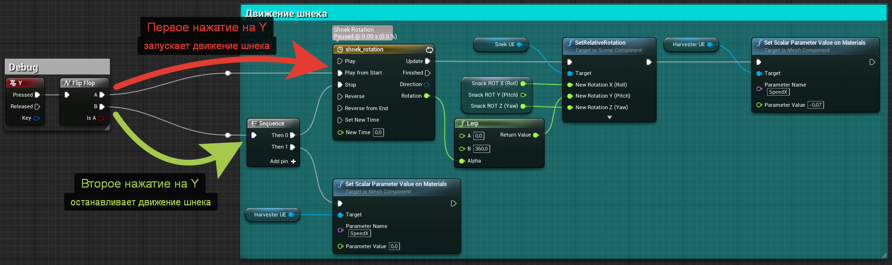
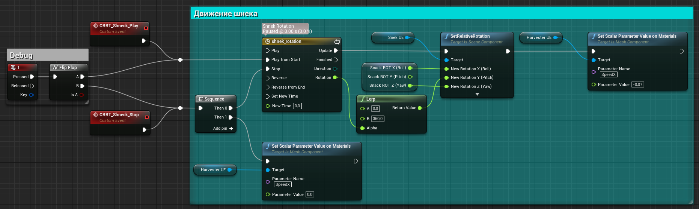
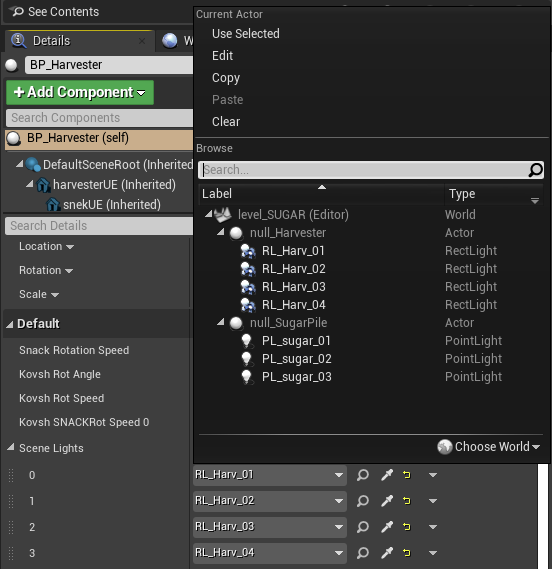

# Как подготовить ассеты на Unreal Engine 4.27 для Carrot

> В этом разделе на примерах вы узнаете, как создавать ассеты, готовые для работы с Carrot.
 Процессы моделлирования, текстурирования и т.д. затрагиваться не будут.
 
 В раздел входит: 
 1. Структура папок и нейминг ассетов внутри Content Browser.
 1.1. Структура папок
 1.2. Нейминг ассетов
 1.2.1 Нейминг материалов
 1.2.2 Нейминг текстур
 2. Иерархия элементов внутри World Outliner.
 3. Работа со слоями внутри Editor.
 4. Создание и настройка управляющей логики под плейлист Carrot.

## 1. Структура папок и нейминг ассетов внутри Content Browser. Как правильно это делать.

**Пример, нам прислали следующие подводки:**

1. На подводку к сюжету про сахар ставим свеклоуборочный комбайн, позади него гора сахара, которую он образно произвел. Сыпать из комбайна на гору сахар не нужно, но у него что-то должно двигаться, работать.

2. На подводку к сюжету о логистике нужен корабль контейнеровоз и кран, загружающий/разгружающий контейнер. Можно попробовать налить воды ниже уровня сцены, но только если она будет реалистичной.

3. Великая Европейская стена. Типа отделяет Запад от России. Стена наподобие китайской. Идет из экрана ( из за горизонта ) - слева от таблетки. Извилистая. Перед таблеткой как бы ворота в стене. Перед ней стоит фура , современная. Типа не может попасть на запад.

4. Тема про жилье. Слева от таблетки строительный кран, со стрелой над таблеткой, кран поднимает плиту. Справа от таблетки строящийся дом( еще недостроен до крыши) Кран работает, плиту переносит на дом. В какой то момент плита зависает на таблеткой - типа стройка остановилась. Надо еще небо. А по периметру над декорациями высятся готовые высотки, целый город

Мы выбрали подводку к сюжету про сахарную гору и комбайн с определенным действием по кнопке для AR проекта. С чего начать?

 

### 1.1. Структура папок
У каждого ассета должна быть своя папка, желательно с порядковым номером и написанием капсом. Это очень ***круто*** и ***удобно***.

По имени и нумерации найти папку со всем необходимым проще, чем метаться между **всем** контентом, не правда ли? А ведь ещё это можете быть не вы, а инженер на мероприятии, которому погружаться в особенности вашего творческого беспорядка будет некогда.

Лучше всего это сделать сразу, т.к. потом в процессе переименовывания/перетаскивания у ассетов могут слететь ссылки на меши/материалы/текстуры, либо анрил просто сложится.

В `Content Browser`, внутри `Content` создаём папку с названием содержимого. Это может быть название подводки, сюжета или главного объекта. В нашем случае это `01_SUGAR`, нумерация соответствует нумерации списка от заказчика со всеми подводками к выпуску:

В созданной папке `01_SUGAR` создаем следующие подпапки по мере надобности:
 
Название папки | Описание
-|-
**Animations** | Анимации для Skeletal Mesh, алембики, секвенцеры и т.д.
**Blueprints** | Управляющие блупринты, префабы объектов, Material Parameter Collection и всё остальное, что связано с логикой.
**FX** | Эффекты Niagara и Cascade
**Levels** | Уровни с объектами
**Materials** | -
**Mesh** | Сюда кидаем наши импортнутые FBX, OBJ и т.д.
**Textures** | -

 Если объектов внутри одной подводки несколько, то сначала надо создать папку с именем объекта, а внутри неё уже устраивать наполнение по умолчанию. У нас эта структура будет иметь следующий вид:

Название папки | Описание
-|-
`01_SUGAR` | Название папки с подводкой
`01_Harvester` | Папка со всем содержимым для свеклоуборочного комбайна
`02_Sugarpile` | Папка со всем содержимым для горы сахара

> В примере выше объекты не имеют отдельных уровней под комбайн и гору, т.к. объекты простые, поэтому они собраны вместе на одном, поэтому папка `_Levels` находится в корне папки `01_SUGAR` и визуально выделена нижним подчеркиванием.
 

### 1.2. Нейминг ассетов
#### 1.2.1 Нейминг материалов

Материалы называем также как и ассет, если требуется разбить на несколько материалов, то пишем:
  `M_` + `название ассета` + `_название детали или группы деталей`
  Если используем мастер материалы, то пишем:
  `MM_` + `название ассета`, а инстансы подписываем `MI_` + `название ассета` + `_название детали или группы деталей`

> Кому интересны все рекомендованные префиксы ассетов - [ссылка на док](https://docs.unrealengine.com/4.27/en-US/ProductionPipelines/AssetNaming/).

 **Пример:**
    
    M_Harvester_glass
    M_Harvester_wheels
    M_Harvester_chassis
    M_Harvester_gum
    M_Harvester_plastic
    MM_Harvester
    MI_Harvester_wheels
 

#### 1.2.2 Нейминг текстур

Текстуры называем по той же логике что и все остальное: `T_название ассета_суффикс`.

> **T** for **ТЕКСТУРА**
 

Тип текстуры | Суффикс
-|-
**Base color** | _D
**Metallic** | _M
**Specular** | _S
**Roughness** | _R
**Normal** | _N
**Displacement** | _DP
**Ambient Occlusion** | _AO
**Height Map** | _H
**Flow Map** | _FM
**Light Map (fake)** | _L
**Mask** | _MA

 

**Пример:**
    
    T_Harvester_D
    T_Harvester_M
    и.т.д.

## 2. Иерархия элементов внутри World Outliner. Как надо, чтобы инженеры зауважали.

Первым делом мы создаём новый уровень, в который будем накидывать объекты и настраивать, по первому времени, ассеты. Называем его по имени основного объекта, либо подводки под которую ассеты создаются без префиксов: `название`. Если уровень составной или имеет несколько итераций, то пишем `название` + `_назначение` + `_порядкой номер`. Если над проектом пыхтят несколько трудяг одновременно, то каждый создаёт себе новый уровень с обозначением того, что на этом уровне делалось.

 

**Пример:**
    
    01_SUGAR
    01_SUGAR_lighting
    01_SUGAR_lighting_02
    01_SUGAR_02_environment_03
    и.т.д.
> Составные уровни в 99% случаев используются при создании глобальных сцен (студии, пустыни, города, поля) под VR проект на зелёнке. Отдельно освещение, отдельно объекты ближнего плана, дальнего плана, ключевые объекты и т.д.  В AR проектах такая реализация используется меньше. Если ассет делали несколько людей, то финальный результат должен быть в одном уровне.
 

Открываем уровень, кидаем объекты, развлекаемся. В процессе творения получилось что-то такое:
 

 

Cтруктура папок создана, текстуры и анимации раскиданы по папкам, материалы накручены, блупринты накожены, свет выставлен. **Что дальше?**

После всех наших первичных манипуляций иерархия уровня, скорее всего, будет выглядеть так:

> В данном примере мы выбрали реализацию через упаковку геометрии с анимацией и логикой напрямую в **Actor Blueprint** (ещё называют Prefab) `BP_Harvester` и `BP_SugarPile`. Зачем и почему, как сделать и какие ещё виды реализации существуют читаем [здесь](TODO).
 

В итоге получается полная каша и неразбериха. Как создатель вы, возможно, и сможете ориентироваться в подобном, но любой другой после вас **вряд ли**. 

Нам нужно сделать так, чтобы эти объекты было легко найти среди остального контента `World Outliner` собранного на эфир проекте, мы могли перетаскивать, крутить и масштабировать объекты, причем чтобы мы могли двигать объект как вместе со всем освещением, так и отдельно от него, не ломая выполнение логики в **Actor Blueprint**. Тут на помощь приходят `Empty Actor`.

Добавляем `Empty Actor` для перемещения всего комбайна с освещением, называем его `null_Harvester`. Прикрепляем `BP_Harvester` и нужные источники света к созданному нулику.

Создаём ещё один `Empty Actor`, но уже для перемещения комбайна отдельно от освещения, называем его `hlp_Harvester`. Прикрепляем `BP_Harvester`.

В зависимости от задачи, объектом нужно будет манипулировать относительно его собственного **Pivot point**, либо относительно другого объекта. В наше случае комбайн должен вращаться вокруг собственной нулевой точки, поэтому **важно**, чтобы **Pivot point** у объекта и нулика были в одной точке, напоминаю, что при работе через [Multi-user](TODO) мы не можем трогать **Blueprint Actor** напрямую:

На выходе мы должны получить следующую иерархию уровня:

Теперь, двигая за соответствующие дамики мы можем манипулировать как всей сценой целиком, так и отдельными объектами.

## 3. Работа со слоями внутри Editor.

После завершения всех работ созданный контент требуется вынести в отдельный слой. Делается это для того, чтобы в собранном проекте можно было быстро скрыть и отобразить целую группу элементов на уровне.

> Опция работает исключительно внутри редактора, аналогична глазу напротив объекта в `World Outliner`, на проект в режиме **Game** она никак не влияет.

Т.е. чтобы при вместо этого:

Можно было сделать вот так:

Для того, чтобы добавить объекты в слой:

1. Выделяем в `World Outliner` нужные объекты.
    > Если объекты лежат в пределах одного уровня, то для быстрого выбора можно включить режим `Only in Current Level`. Для этого внутри вкладки `Levels` двойным кликом выделяем нужный уровень, далее в `World Outliner` выбираем **View Options** -  **Only in Current Level**:
      
2. Не снимая выделения, переходим во вкладку `Layers`
    > Если вкладки `Layers` нет, то включить её можно через **Window** - **Layers**
      
3. ПКМ по пустой области вкладки `Layers` - **Add Selected Actors to New Layer**
    
4. Называем слой в соответствии с уровнем `01_SUGAR`

## 4. Создание и настройка управляющей логики под плейлист Carrot.

Для отладки работы логики в `Actor Blueprint`, мы эмулируем команду из Carrot при помощи обычной клавиши на клавиатуре.

Добавление клавиши происходит следующим образом:
     

Для удобства сделаем так, чтобы при нажатии на одну кнопку события поочередно переключались. Для этого используем ноду `Flip Flop`, подробней про ноду [в документации к Unreal Engine](https://docs.unrealengine.com/4.27/en-US/ProgrammingAndScripting/Blueprints/UserGuide/FlowControl/#flipflop):
     

Проверяем работу в режиме `Play`. Нажимаем клавишу `Y`, смотрим как отрабатывает логика:
     

Удостоверившись в работоспособности создаём событие, которое в дальнейшем будет использоваться Carrot для воспроизведения из плейлиста.

Делаем это через ноду `Add Custom Event`, подробней [в документации к Unreal Engine](https://docs.unrealengine.com/4.27/en-US/ProgrammingAndScripting/Blueprints/UserGuide/Events/Custom/):
     

Добавляем событие на показ и отдельное событие на скрытие. Для удобства дальнейшего поиска добавляем к названию события префикс `CRRT_`:
     

Помимо анимации по кнопке, описанной в ТЗ, нам понадобится логика, которая будет отвечать за отображение объекта, потому что до момента проигрывания, весь контент должен быть скрыт.

Для этого создаём логику.
 Тип переменной `Scene Lights` - `Light`:
     

Разбирать её не будем, приложу только документацию по отдельным элементам:
1. [Переменные в Blueprint](https://docs.unrealengine.com/4.26/en-US/ProgrammingAndScripting/Blueprints/UserGuide/Variables/)
2. [Массивы переменных в Blueprint](https://docs.unrealengine.com/4.26/en-US/ProgrammingAndScripting/Blueprints/UserGuide/Arrays/)

Мы создали логику для скрытия света, но ещё не указали источники освещения. Для этого:
1. В `World Outliner` выбираем `BP_Harvester`.
2. В вкладке `Details` находим переменную **Scene Lights**.
     
3. Указываем нужные источники освещения.
> Указывать можно только те источники света, которые находятся на одном уровне с **Blueprint Actor**.

> Если переменной в вкладке `Details` нет, проверяем, стоит ли галка `Instance Editable` в свойствах переменной:
  

4. Проверяем работу логики.

# TODO
- [] Проверяем Pivot в блупринте
- [] Виды реализации контента для Carrot. Разница, преимущества и недостатки.
- [] Sort Translucency
- [] Сторонний контент
- [] Метрика производительности, способы оптимизации
