# Пайплайн подготовки Carrot + Unreal
## 1. Работа с Carrot

### 1.1 Создание схемы

Описан в [Дополненная реальность (AR) с Unreal Engine](https://carrotsoftware.github.io/docs/4062/#/examples?id=Дополненная-реальность-ar-с-unreal-engine).

### 1.2 Подготовка проекта

Описан в [Настройка UE проекта (новый плагин)](https://carrotsoftware.github.io/docs/4062/#/workflow?id=Настройка-ue-проекта-новый-плагин) и [Настройка UE проекта (старый плагин)](https://carrotsoftware.github.io/docs/4062/#/workflow?id=Настройка-ue-проекта-старый-плагин).

### 1.3 Работа с трекингом
#### 1.3.1 Меню настроек
Работа с трекинг данными в Carrot Engine представлена в виде настроек контента (аналогично нодам Keyer, AR и т.д.) для добавленных в Engine Scheme входных источников BMD Tracked Input, AJA Tracking Input и Tracking Data.

Для доступа к настройкам трекинга (горячая клавиша - `F7`):
1. В окне Carrot Engine откройте меню Tools - Content Settings
2. Выберите название контента с трекингом (BMD Tracked Input, AJA Tracking Input или Tracking Data).

Откроется следующее окно:

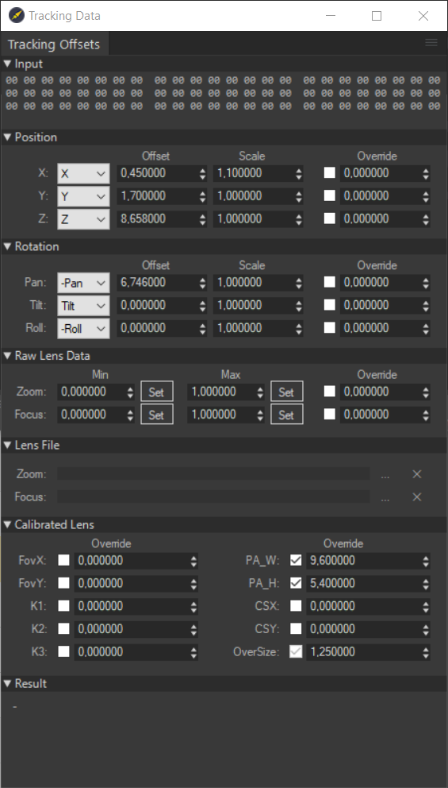

Вкладка `Input` - отображает входящие по указанному порту в `Carrot Launcher` трекинг данные.
> Значение всех строк равное `00`, отсутствие изменений значений или вовсе отсутствие каких-либо значений сигнализирует о том, что трекинг данные не приходят на рендер машину.

- Вкладка `Position` - позволяет указать интерпритацию входящий трекинг данных по позиции в пространстве, добавить смещение (Offset), добавить множитель (Scale), перезаписать данные на пользовательские (Overridde, для перезаписи значений нужно поставить флажок напротив значения)
- Вкладка `Rotation` - позволяет указать интерпритацию входящий трекинг данных по вращению в пространстве, добавить смещение (Offset), добавить множитель (Scale), перезаписать данные на пользовательские (Overridde, для перезаписи значений нужно поставить флажок напротив значения)
- Вкладка `Raw Lens Data` - позволяет нормализовать приходящие значения `Zoom` и `Focus` для корректной работы Lens File (Set Min, Set Max) и перезаписать данные на пользовательские (Overridde, для перезаписи значений нужно поставить флажок напротив значения).
- Вкладка `Lens File` - позволяет указать путь к калибровочным .xml файлам для `Zoom` и `Focus`, сделанных через `Carrot Lens Calibrator`.
- Вкладка `Calibrated Lens` - позволяет перезаписать значения линзы в трекинг данных.
- Вкладка `Result` - показывает значения трекинга с учетом интерпритации по осям и перезаписанными свойствами (Override). 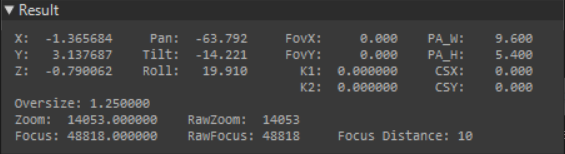

#### 1.3.2 Работа RedSpy + Carrot по разным протоколам
В случае, когда калибровка оборудования RedSpy проводилась через `Carrot Lens Calibrator`, трекинг данные с Main Unit приходят на рендер машину по протоколу FreeD, а не stYpe HF.

Настройки трекинга при работе по протоколу FreeD должны иметь следующую структуру:
- Вкладка `Position`
    - Параметр `X:` = `X`
    - Параметр `X:` = `Z`
    - Параметр `X:` = `-Y`
- Вкладка `Rotation`
    - Параметр `Pan:` = `-Roll`
    - Параметр `Tilt:` = `Tilt`
    - Параметр `Roll:` = `-Roll`
- Вкладка `Raw Lens Data`
    При каждом физическом запуске stYpe RedSpy нужно откалибровывать точки минимума и максимума для Zoom и Focus, для этого:
    1. Запустите RedSpy Main Unit.
    2. Запустить Carrot Engine.
    3. Откройте настройки трекинга.
    4. На камере возьмите максимально общий план.
    5. В настройках трекинга в поле `Zoom Min` нажмите Set.
    6. На камере возьмите максимально крупный план.
    7. В настройках трекинга в поле `Zoom Max` нажмите Set.
    8. На камере возьмите минимальный фокус.
    9. В настройках трекинга в поле `Focus Min` нажмите Set.
    10. На камере возьмите максимальный фокус.
    11. В настройках трекинга в поле `Focus Max` нажмите Set.
- Вкладка `Lens File`
    - Укажите в свойствах `Zoom:` и `Focus:` путь к калибровочным .xml файлам для `Zoom` и `Focus`, сделанных через `Carrot Lens Calibrator`.

Настройки трекинга при работе по протоколу stYpe HF должны иметь следующую структуру:
- Вкладка `Position`
    - Параметр `X:` = `X`
    - Параметр `X:` = `Y`
    - Параметр `X:` = `Z`
- Вкладка `Rotation`
    - Параметр `Pan:` = `-Roll`
    - Параметр `Tilt:` = `Tilt`
    - Параметр `Roll:` = `-Roll`
- Вкладка `Lens File`
    - Укажите только в свойстве `Focus:` путь к калибровочным .xml файлу, сделанного через `Carrot Lens Calibrator`.

1. На камере возьмите максимально крупный план, затем максимально общий.
2. На камере возьмите минимальный фокус, затем максимальный фокус.

## 2. Структура контента в Unreal Engine

### 2.1 Уровни
Для модульности и удобства работы мы рекомендуем создавать под сцены отдельные уровни. При более комплексных вариантах и многопользовательнской работе уровень лучше дробить на разные составляющие.

**Пример:**
    
    01_SUGAR
    01_SUGAR_lighting
    01_SUGAR_lighting_02
    01_SUGAR_02_environment_03
    и.т.д.

Для удобной работы через Multi-User рекомендуется придерживаться следующей иерархии уровня:

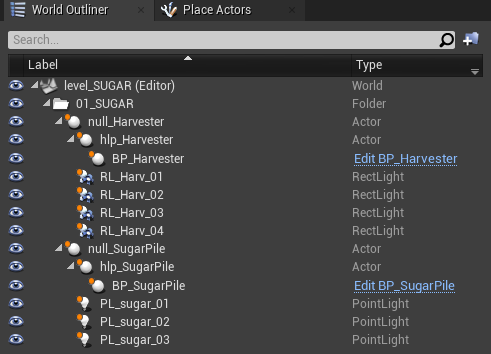

Где:
- Все объекты на уровне лежат внутри папки, именованной согласно названию подводки или объекта.
- Каждый объект прикреплен к `Empty Actor`, позволяющий передвигать объекты группами
    - **null_Harvester** и **null_SugarPile** позволяют трансформировать объект вместе с освещением.
    - **hlp_Harvester** и **hlp_SugarPile** позволяют трансформировать объект отдельно от освещения.

### 2.2 Объекты
- Каждый объект должен находиться в своем `Blueprint Actor` или быть указан в "управляющем" `Blueprint Actor` (например, объекты были импортированы с анимацией из сцены Cinema 4D, тогда лучше указать все `Blueprint Actor` в блупринте через теги или слои).
- Все непрозрачные объекты должны иметь свойство `Render CustomDepth Pass 1` и `CustomDepth Stencil Value 255`.
- Простые анимации лучше выполнять через `Timeline` в `Blueprint Actor`.
- Комплексные анимации, созданные через `Sequencer`, должны иметь свой `Sequencer Actor` на главном уровне, где находится и **Carrot Macro**.
    - На главном уровне, внутри `Level Blueprint` должен быть указан `Sequencer Actor` и команды на воспроизведение до конца и сброс.
- Объект должен состоять минимум из 2 состояний в виде `Custom Event`:
    - Объект показан (все компоненты Visible и Hidden in game 0)
    - Объект скрыт (все компоненты Visible и Hidden in game 1, должно инициироваться по умолчанию при `EventBeginPlay`)
- Для удобства работы с множественными объектами рекомендуется создавать и добавлять их в соответствующие Layer. Эта опция работает исключительно внутри редактора, аналогична глазу напротив объекта в `World Outliner`, на проект в режиме **Game** при работе в Multi-User она никак не влияет.

#### 2.2.1 Пример управляющей логики под плейлист Carrot.

Для отладки работы логики в `Actor Blueprint`, мы эмулируем команду из Carrot при помощи обычной клавиши на клавиатуре.

Добавление клавиши происходит следующим образом:
     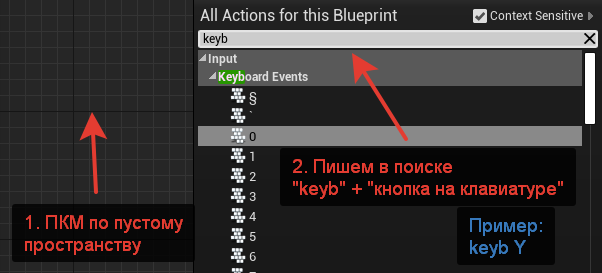

Для удобства сделаем так, чтобы при нажатии на одну кнопку события поочередно переключались. Для этого используем ноду `Flip Flop`, подробней про ноду [в документации к Unreal Engine](https://docs.unrealengine.com/4.27/en-US/ProgrammingAndScripting/Blueprints/UserGuide/FlowControl/#flipflop):
     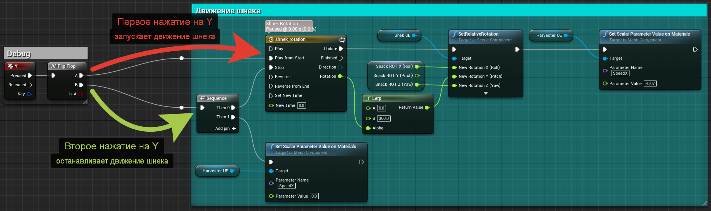

Проверяем работу в режиме `Play`. Нажимаем клавишу `Y`, смотрим как отрабатывает логика:
     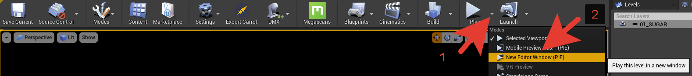

Удостоверившись в работоспособности создаём событие, которое в дальнейшем будет использоваться Carrot для воспроизведения из плейлиста.

Делаем это через ноду `Add Custom Event`, подробней [в документации к Unreal Engine](https://docs.unrealengine.com/4.27/en-US/ProgrammingAndScripting/Blueprints/UserGuide/Events/Custom/):
     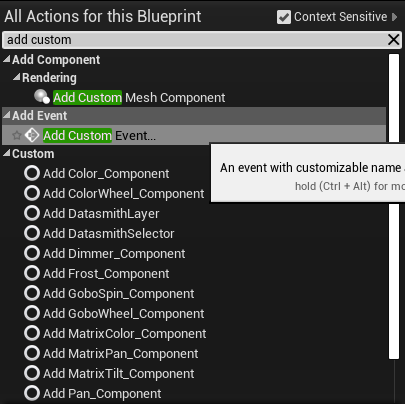

Добавляем событие на показ и отдельное событие на скрытие. Для удобства дальнейшего поиска добавляем к названию события префикс `CRRT_`:
     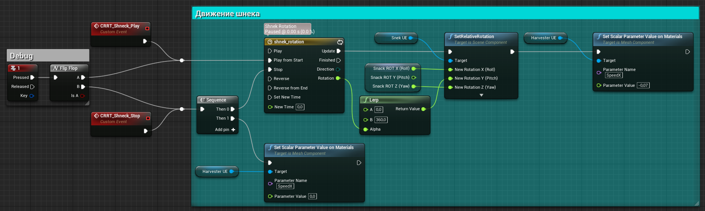

Помимо отображения самой геометрии, нам также нужно скрывать всё содержимое сцены. В данном случае вместе с геометрией скрываться нужно ещё источнику освещения.

Для этого создадим соответствующую логику:
 Тип переменной `Scene Lights` — `Light`:
     

Документация по отдельным элементам:
1. [Переменные в Blueprint](https://docs.unrealengine.com/4.26/en-US/ProgrammingAndScripting/Blueprints/UserGuide/Variables/)
2. [Массивы переменных в Blueprint](https://docs.unrealengine.com/4.26/en-US/ProgrammingAndScripting/Blueprints/UserGuide/Arrays/)

Мы создали логику для скрытия света, но ещё не указали источники освещения на уровне сцены. Для этого:
1. В `World Outliner` выбираем `BP_Harvester`.
2. В вкладке `Details` находим переменную **Scene Lights**.
     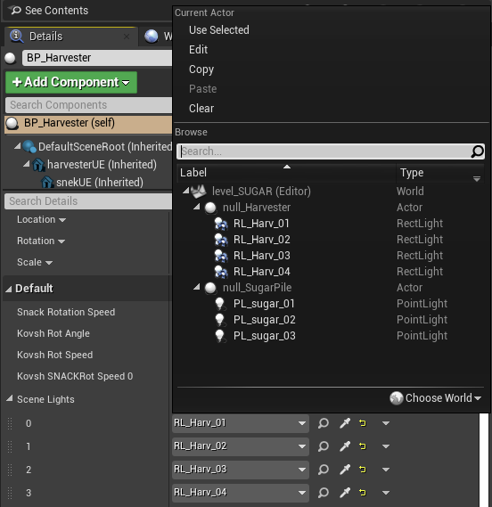
3. Указываем нужные источники освещения.
> Указывать можно только те источники света, которые находятся на одном уровне с **Blueprint Actor**.

> Если переменной в вкладке `Details` нет, проверяем, стоит ли галка `Instance Editable` в свойствах переменной:
  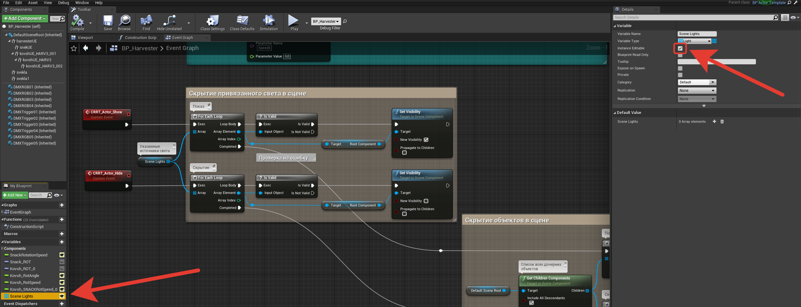

4. Проверяем работу логики.

Повторяем манипуляции с `BP_SugarPile`.

На выходе получаем блупринты с 2 событиями на показ/скрытие геометрии вместе с источниками освещения и 2 событиями на воспроизведение/сброс анимации (только для `BP_Harvester`).

В **Blueprint Actor** вызываем и подключаем к ноде `Event BeginPlay` наше событие `CRRT_Actor_Hide`, чтобы при старте проекта объект был скрыт по умолчанию. Написав в поиске `call`, получаем список всех событий внутри блупринта для быстрой навигации:
  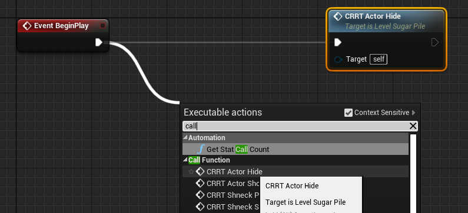

#### 2.2.2 Перенос готового ассета и подключение к Carrot Macro.

Все элементы готовы, теперь необходимо подготовить ассет к отправке сборщику UE проекта. Для этого потребуется написать логику внутри `Level Blueprint` уровня `level_SUGAR`, которая будет обращаться к созданному **Blueprint Actor** и запрашивать у него созданные нами события (показ/скрытие/воспроизведение/сброс).

Обратиться к блупринту на уровне можно через ноду `Get Actor of Class` (не путать с `Get All Actors of Class`, которая возвращает массив всех совпадающих блупринтов на уровне, нам нужен только один объект). 

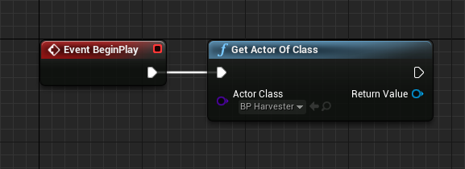

Из `Return Value` вытягиваем новую ноду и в поиске ищем события, созданные для Carrot (префикс `CRRT`). 

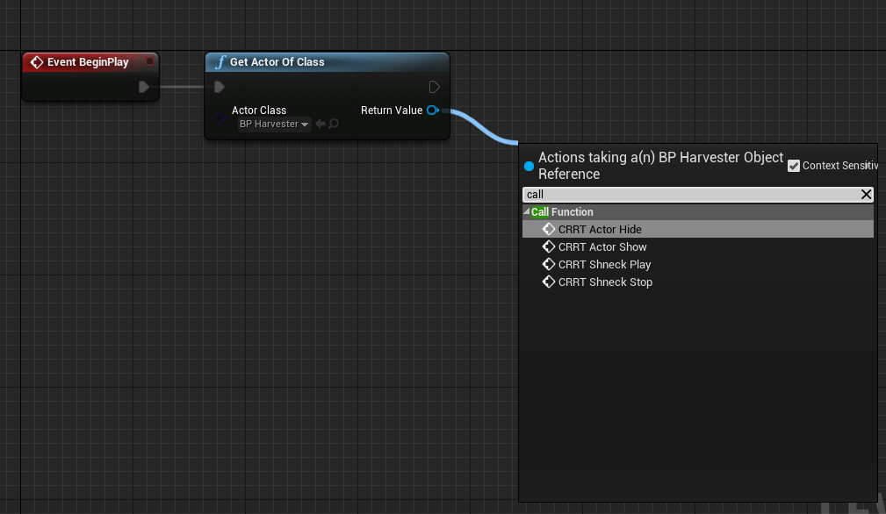

Добавляем все необходимые события:

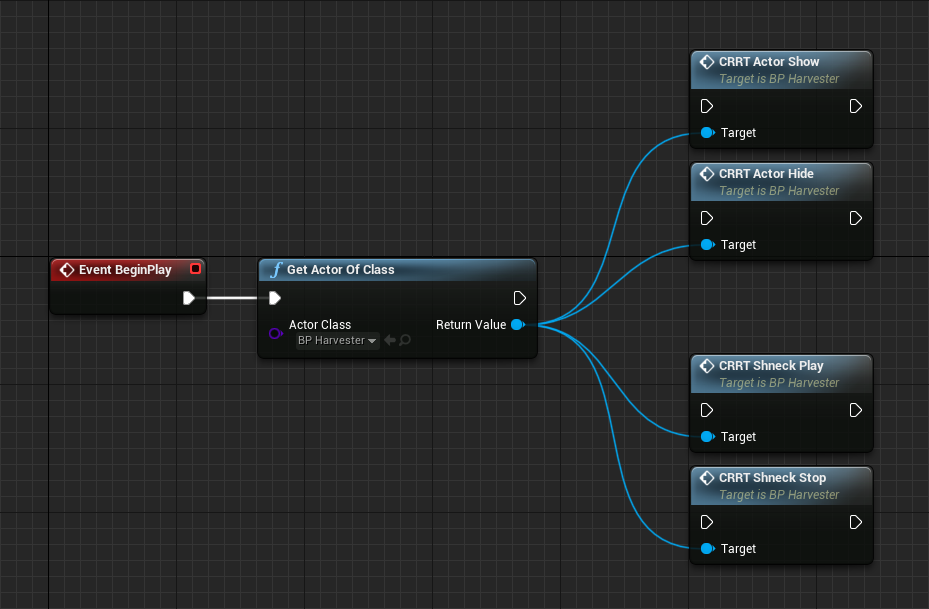

Проверяем, что из **Level Blueprint** все события вызываются и работают. Подключаем тестовые кнопки, отличные от тех, что были в **Blueprint Actor**, если их не удаляли из логики. Не забываем включить `Input` - `Auto Receive Input` - `Player 0`, чтобы нажатия кнопок считывались.

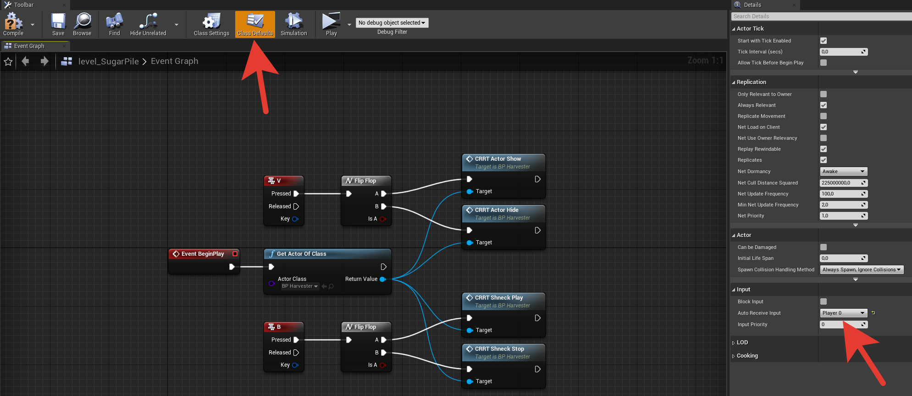

Когда убедились, что всё работает, идём в `Content Browser`, ПКМ по папке с готовым контентом `Fix Up Redirectors in Folder` и после этого жмём `Migrate`. Проверяем, что все файлы лежат на своих местах и мы не тянем без лишней надобности из других папок текстуры и прочее.

#### 2.2.3 Экспорт шаблона

Описан в [Экспорт шаблона из проекта UE4](https://carrotsoftware.github.io/docs/4062/#/workflow?id=Экспорт-шаблона-из-проекта-ue4).

#### 2.2.4 Дополненная реальность (AR) с Unreal Engine

Описано в [Дополненная реальность (AR) с Unreal Engine](https://carrotsoftware.github.io/docs/4062/#/examples?id=%d0%94%d0%be%d0%bf%d0%be%d0%bb%d0%bd%d0%b5%d0%bd%d0%bd%d0%b0%d1%8f-%d1%80%d0%b5%d0%b0%d0%bb%d1%8c%d0%bd%d0%be%d1%81%d1%82%d1%8c-ar-%d1%81-unreal-engine)

## 3. Работа с Multi-User

Описано в [официальной документации Unreal Engine](https://docs.unrealengine.com/4.27/en-US/ProductionPipelines/MultiUserEditing/QuickStart/).

### 3.1 Процедуры перед трактом
Необходимые действия перед трактом

1. Подключить управляющий компьютер с UE проектом к одной локальной сети с рендер станциями.
2. Запустить **Launcher** на рабочей станции.
3. Скачать проект из SVN на рендер станцию и машину, выступающую Multi-User сервером.
    1. На машине, являющаяся Multi-User сервером, нужно запустить проект через Editor и запустить сервер Multi-User.
        1. В окне `Session Browser` создать сессию и подключиться к ней.
    2. На рендер станции запустить проект через `StartMultiUser.bat`, предварительно в нём указать название машины и сессии к которой нужно подключиться.

Если всё прошло успешно, то рендер станция на запуске сразу подключается к указанной сессии, если этого не произошло, то нужно закрыть UE проект и открыть его на рендер станции через Editor, проверить видно ли сессии через Session Browser.

Если видно, то:
1. Проверить название сессии
2. Проверить имя машины (видно в Session Browser)
    
Если не видно, то:
1. Перезагрузить сервер MultiUser, проверить
2. Перегрузить оба ПК, проверить
    
Если не помогло, то:
1. На всех машинах открыть **Project Settings,** **Plugins - UDP Messaging** найти свойство **Transport - Unicast Endpoint.**
2. Поставить у Multi-User сервера **IP адрес нужного сетевого адаптера**, порт 0. По умолчанию адрес 0.0.0.0:0 определяет первую найденную в систему сетевую карту, которая может отличаться от той, на которой происходит подключение (WiFi адаптер на ноуте и Ethernet адаптер, например)
3. Раскрыть дополнительные настройки **Transport,** выбрать **Static Endpoints**.
4. Перезапустить Multi-User сервер.
5. Переоткрыть UE проекты.
6. Проверить видно ли сессии в Session Browser.
7. Запустить проект в режиме `Game` и запустить шаблон в плейлисте.

### 3.2 После тракта

1. На Multi-User сервере нажать `Save All`, `Persist Changes`, ещё раз `Save All`.
2. Выйти из сессии.
3. Закрыть проекты на рендер станциях.
4. Выключить сервер.
5. Выгрузить все изменения в SVN.
6. Синхронизировать проект по SVN.
7. Запустить проект через `StartGame.bat`.
8. Проиграть шаблоны, убедиться что все изменения сохранились.