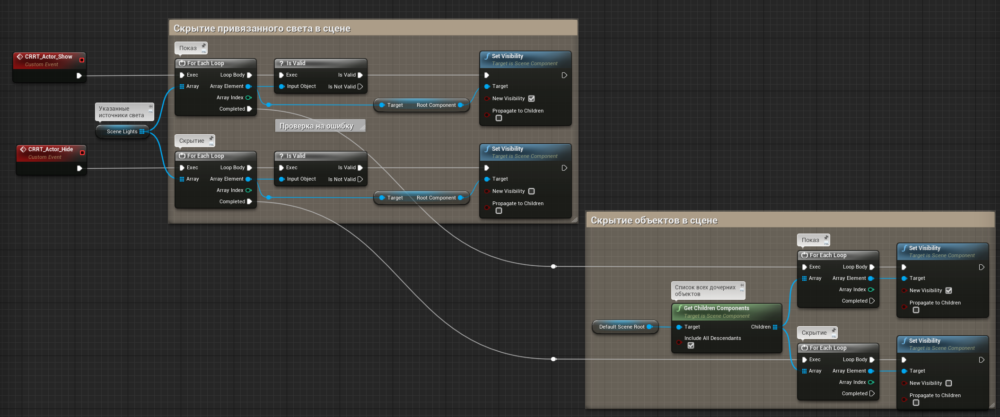

# Пайплайн подготовки Carrot + Unreal
## 1. Работа с Carrot

### 1.1 Создание схемы

Описан в [AR с использованием UE4](https://carrotsoftware.github.io/docs/4062/#/workflow?id=ar-с-использованием-ue4).

### 1.2 Подготовка проекта

Описан в [Настройка UE проекта (новый плагин)](https://carrotsoftware.github.io/docs/4062/#/workflow?id=Настройка-ue-проекта-новый-плагин) и [Настройка UE проекта (старый плагин)](https://carrotsoftware.github.io/docs/4062/#/workflow?id=Настройка-ue-проекта-старый-плагин).

## 2. Структура контента в Unreal Engine

### 2.1 Уровни
Для модульности и удобства работы мы рекомендуем создавать под сцены отдельные уровни. При более комплексных вариантах и многопользовательнской работе уровень лучше дробить на разные составляющие.

**Пример:**
    
    01_SUGAR
    01_SUGAR_lighting
    01_SUGAR_lighting_02
    01_SUGAR_02_environment_03
    и.т.д.

Для удобной работы через Multi-User рекомендуется придерживаться следующей иерархии уровня:

Где:
- Все объекты на уровне лежат внутри папки, именованной согласно названию подводки или объекта.
- Каждый объект прикреплен к `Empty Actor`, позволяющий передвигать объекты группами
    - **null_Harvester** и **null_SugarPile** позволяют трансформировать объект вместе с освещением.
    - **hlp_Harvester** и **hlp_SugarPile** позволяют трансформировать объект отдельно от освещения.

### 2.2 Объекты
- Каждый объект должен находиться в своем `Blueprint Actor` или быть указан в "управляющем" `Blueprint Actor` (например, объекты были импортированы с анимацией из сцены Cinema 4D, тогда лучше указать все `Blueprint Actor` в блупринте через теги или слои).
- Все непрозрачные объекты должны иметь свойство `Render CustomDepth Pass 1` и `CustomDepth Stencil Value 255`.
- Простые анимации лучше выполнять через `Timeline` в `Blueprint Actor`.
- Комплексные анимации, созданные через `Sequencer`, должны иметь свой `Sequencer Actor` на главном уровне, где находится и **Carrot Macro**.
    - На главном уровне, внутри `Level Blueprint` должен быть указан `Sequencer Actor` и команды на воспроизведение до конца и сброс.
- Объект должен состоять минимум из 2 состояний в виде `Custom Event`:
    - Объект показан (все компоненты Visible и Hidden in game 0)
    - Объект скрыт (все компоненты Visible и Hidden in game 1, должно инициироваться по умолчанию при `EventBeginPlay`)
- Для удобства работы с множественными объектами рекомендуется создавать и добавлять их в соответствующие Layer. Эта опция работает исключительно внутри редактора, аналогична глазу напротив объекта в `World Outliner`, на проект в режиме **Game** при работе в Multi-User она никак не влияет.

#### 2.2.1 Пример управляющей логики под плейлист Carrot.

Для отладки работы логики в `Actor Blueprint`, мы эмулируем команду из Carrot при помощи обычной клавиши на клавиатуре.

Добавление клавиши происходит следующим образом:
     

Для удобства сделаем так, чтобы при нажатии на одну кнопку события поочередно переключались. Для этого используем ноду `Flip Flop`, подробней про ноду [в документации к Unreal Engine](https://docs.unrealengine.com/4.27/en-US/ProgrammingAndScripting/Blueprints/UserGuide/FlowControl/#flipflop):
     

Проверяем работу в режиме `Play`. Нажимаем клавишу `Y`, смотрим как отрабатывает логика:
     

Удостоверившись в работоспособности создаём событие, которое в дальнейшем будет использоваться Carrot для воспроизведения из плейлиста.

Делаем это через ноду `Add Custom Event`, подробней [в документации к Unreal Engine](https://docs.unrealengine.com/4.27/en-US/ProgrammingAndScripting/Blueprints/UserGuide/Events/Custom/):
     

Добавляем событие на показ и отдельное событие на скрытие. Для удобства дальнейшего поиска добавляем к названию события префикс `CRRT_`:
     

Помимо отображения самой геометрии, нам также нужно скрывать всё содержимое сцены. В данном случае вместе с геометрией скрываться нужно ещё источнику освещения.

Для этого создадим соответствующую логику:
 Тип переменной `Scene Lights` — `Light`:
     

Документация по отдельным элементам:
1. [Переменные в Blueprint](https://docs.unrealengine.com/4.26/en-US/ProgrammingAndScripting/Blueprints/UserGuide/Variables/)
2. [Массивы переменных в Blueprint](https://docs.unrealengine.com/4.26/en-US/ProgrammingAndScripting/Blueprints/UserGuide/Arrays/)

Мы создали логику для скрытия света, но ещё не указали источники освещения на уровне сцены. Для этого:
1. В `World Outliner` выбираем `BP_Harvester`.
2. В вкладке `Details` находим переменную **Scene Lights**.
     
3. Указываем нужные источники освещения.
> Указывать можно только те источники света, которые находятся на одном уровне с **Blueprint Actor**.

> Если переменной в вкладке `Details` нет, проверяем, стоит ли галка `Instance Editable` в свойствах переменной:
  

4. Проверяем работу логики.

Повторяем манипуляции с `BP_SugarPile`.

На выходе получаем блупринты с 2 событиями на показ/скрытие геометрии вместе с источниками освещения и 2 событиями на воспроизведение/сброс анимации (только для `BP_Harvester`).

В **Blueprint Actor** вызываем и подключаем к ноде `Event BeginPlay` наше событие `CRRT_Actor_Hide`, чтобы при старте проекта объект был скрыт по умолчанию. Написав в поиске `call`, получаем список всех событий внутри блупринта для быстрой навигации:
  

#### 2.2.2 Перенос готового ассета и подключение к Carrot Macro.

Все элементы готовы, теперь необходимо подготовить ассет к отправке сборщику UE проекта. Для этого потребуется написать логику внутри `Level Blueprint` уровня `level_SUGAR`, которая будет обращаться к созданному **Blueprint Actor** и запрашивать у него созданные нами события (показ/скрытие/воспроизведение/сброс).

Обратиться к блупринту на уровне можно через ноду `Get Actor of Class` (не путать с `Get All Actors of Class`, которая возвращает массив всех совпадающих блупринтов на уровне, нам нужен только один объект). 

Из `Return Value` вытягиваем новую ноду и в поиске ищем события, созданные для Carrot (префикс `CRRT`). 

Добавляем все необходимые события:

Проверяем, что из **Level Blueprint** все события вызываются и работают. Подключаем тестовые кнопки, отличные от тех, что были в **Blueprint Actor**, если их не удаляли из логики. Не забываем включить `Input` - `Auto Receive Input` - `Player 0`, чтобы нажатия кнопок считывались.

Когда убедились, что всё работает, идём в `Content Browser`, ПКМ по папке с готовым контентом `Fix Up Redirectors in Folder` и после этого жмём `Migrate`. Проверяем, что все файлы лежат на своих местах и мы не тянем без лишней надобности из других папок текстуры и прочее.

#### 2.2.3 Экспорт шаблона

Описан в [Экспорт шаблона из проекта UE4](https://carrotsoftware.github.io/docs/4062/#/workflow?id=Экспорт-шаблона-из-проекта-ue4).

## 3. Работа с Multi-User